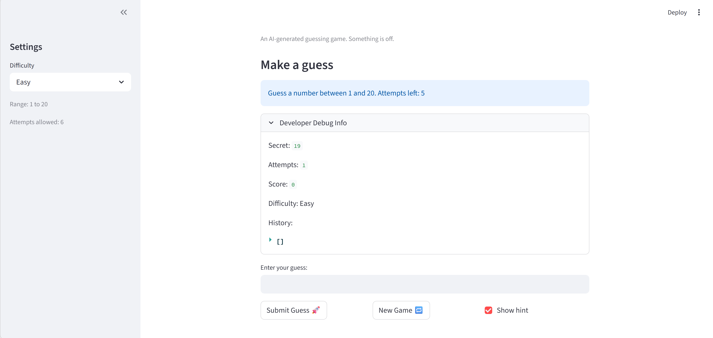
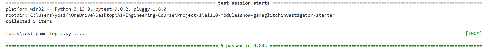

# 🎮 Game Glitch Investigator: The Impossible Guesser

## 🚨 The Situation

You asked an AI to build a simple "Number Guessing Game" using Streamlit.
It wrote the code, ran away, and now the game is unplayable. 

- You can't win.
- The hints lie to you.
- The secret number seems to have commitment issues.

## 🛠️ Setup

1. Install dependencies: `pip install -r requirements.txt`
2. Run the broken app: `python -m streamlit run app.py`

## 🕵️‍♂️ Your Mission

1. **Play the game.** Open the "Developer Debug Info" tab in the app to see the secret number. Try to win.
2. **Find the State Bug.** Why does the secret number change every time you click "Submit"? Ask ChatGPT: *"How do I keep a variable from resetting in Streamlit when I click a button?"*
3. **Fix the Logic.** The hints ("Higher/Lower") are wrong. Fix them.
4. **Refactor & Test.** - Move the logic into `logic_utils.py`.
   - Run `pytest` in your terminal.
   - Keep fixing until all tests pass!

## 📝 Document Your Experience

- [ ] Describe the game's purpose: The purpose of the game is to allow the user to guess a secret number generated by the program. The player selects a difficulty level that determines the range of possible numbers. The game provides hints such as "Too High" or "Too Low" to help the player reach the correct number.

- [ ] Detail which bugs you found: I found two main bugs in the game. The first bug was related to the hint system: even when the "Show hint" option was enabled, the hint was not displayed correctly in the interface. The second bug was in the difficulty settings: the easy mode displayed a range of numbers that did not match the actual range used to generate the secret number.

- [ ] Explain what fixes you applied: I refactored the game logic by moving key functions into `logic_utils.py`, including `check_guess` and `parse_guess`. I implemented the missing logic for these functions and ensured that the hint messages were returned correctly. I also fixed the difficulty logic so that the displayed range matches the range used to generate the secret number. Finally, I verified the fixes by running automated tests with `pytest`, which confirmed that all tests pass.

## 📸 Demo

- [ ] [Insert a screenshot of your fixed, winning game here]

- [] [This is a screenshot showing the success of my test cases]

## 🚀 Stretch Features

- [ ] [If you choose to complete Challenge 4, insert a screenshot of your Enhanced Game UI here]
